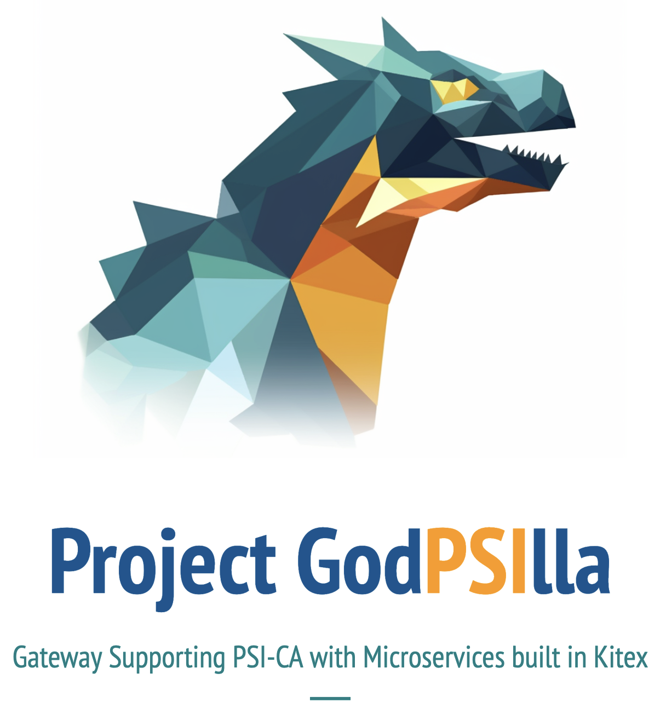

IDL_management_page contains the user interface

Gateway-Generator contains the Code generator

pages-backend-test contains the backend server for interacting with the database

## Docker Setup guide

1.  RUN `docker pull quay.io/coreos/etcd:v3.5.0` to pull etcd image from dockerhub
2.  RUN `docker network create --driver bridge etcd-net` create a etcd-net network
3.  RUN `docker-compose up` at root directory to start he docker container for etcd
4.  RUN `docker pull postgres:latest` to pull etcd image from postgres
5.  RUN `docker run --name some-postgres -e POSTGRES_PASSWORD=mysecretpassword -e POSTGRES_DB=mydatabase -p 5432:5432 -d postgres` to run the database on port 5432
6.  Start the containers on docker, preferably through docker desktop

## Frontend Setup guide (MAKE SURE YOUR DOCKER POSTGRES DATABASE IS UP BY NOW)

1. RUN `cd IDL_management_page/page/my-app/` from ROOT DIRECTORY
2. RUN `npm install` to ensure that the dependencies are up to date
3. RUN `npx prisma migrate dev --name init --schema=prisma/schema.prisma` to apply the migration using the schema to the database
4. RUN `npx prisma generate --schema=prisma/schema.prisma` generate a prisma client using the schema
5. RUN `npm run dev` to run the user interface on port 3000

## Backend Setup guide (MAKE SURE YOUR DOCKER POSTGRES DATABASE IS UP BY NOW)

1. RETURN TO ROOT DIRECTORY
2. RUN `cd pages-backend-test/pages-backend`
3. RUN `npx prisma migrate dev --name init --schema=prisma/schema.prisma` to apply the migration using the schema to the database. Your database needs to be up by now so the migration can be executed.
4. RUN `npx prisma generate --schema=prisma/schema.prisma` generate a prisma client using the schema
5. RUN `node index.js` to run your backend expressjs server on port 3333

## Nginx Setup guide (MacOS)

1. RUN `brew install nginx` install nginx on system

## Nginx Setup guide (Windows)

1. Download Nginx from official Nginx website
2. RUN `setx NGINX_PATH "C:\path\to\nginx\directory" /M` on terminal (IMPORTANT) so as to make the nginx directory availble as a system environmental variable to be located to start nginx

## To Start The Application:

1. RUN `npm run dev` under /IDL_management_page/page/my-app to run the frontend UI if you haven't yet
2. RUN `node index.js` under /pages-backend-test/pages-backend to run the backend server if you haven't yet
3. Open a browser on localhost:3000

## Assumptions:

1. Docker is installed
2. Node.js is installed
3. Nginx is installed
4. Prisma installed globally using `npm install -g prisma`
5. No process is running on ports 8888, 8889, 8890, 20000, 20001, 20002, 5432, 3000, 3333 (Will make improvements to the customisability in the future)

## Troubleshooting:
#### File Related:
- Do the files in Gateway-Generator have execute permission enabled? If not, you might need to change their permissions to be able to execute them.
- Is your etcd cluster up and running? Refer to our etcd setup guide
- Are your microservices up and running and registered to the etcd cluster?

#### Microservice Registration:
- Does your microservice follow the specifications defined in our System Design Document?

#### To do a hard reset of your gateway:
1. Go onto your browser's console and run these to reset the values:
- `localStorage.setItem('running','n')`  associated with whether the gateway is running
- `localStorage.setItem('generated','n')` associated with whether the gateway is generated in Gateway-Generator/gateway
2. Go into Gateway-Generator/gateway and delete everything in the folder
3. Kill all processes on all ports (3000, 3333, 8888, 8889, 8890, [your nginx port, normally 80])
4. Delete the docker container `some-postgres` which is used as our database
5. Rerun step 5 of Docker Setup, steps 3-5 of Frontend setup and steps 3-5 of Backend setup to bootup everything again.

## To do:
- Create shared prisma client so client generation does not have to happen twice
- Move pages-backend out of nested directory
